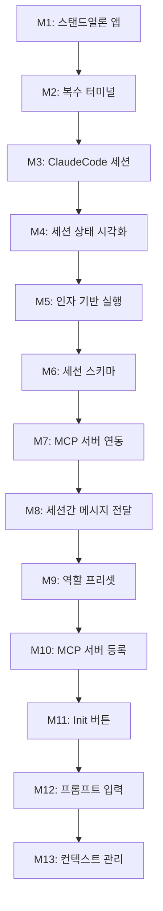

# ClaudeFlow 13단계 마일스톤 체크리스트

> **버전**: v1.1  
> **최종 수정**: 2025-07-29  
> **상태 표기**: `[미개시]` `[작업중]` `[완료됨]` `[블로킹]`

---

## 📊 전체 진행 현황 (업데이트: 2025-07-30)

### Phase별 완료 현황
- **Phase 1 (M1-M5)**: ✅ M1,M2,M3 완료 | 🔄 M4-M5 대기 중 (60% 완료)
- **Phase 2 (M6-M10)**: 🔄 모든 마일스톤 대기 중 (0% 완료)  
- **Phase 3 (M11-M13)**: 🔄 모든 마일스톤 대기 중 (0% 완료)

### 전체 프로젝트 진행률: **23.1%** (3/13 마일스톤 완료) 🎯

### 🎉 최근 완료 성과
- **M1 "스탠드얼론 앱 빌드 및 실행 가능"** - 2025-07-29 완료 (100%)
  - Tauri v2.7.0 + React 19.1.1 + Vite 7.0.6 + TailwindCSS 3.4.17
  - Zustand 5.0.6 상태 관리 + 6개 유닛테스트 통과
  - macOS .app + DMG 생성, 독립 실행 확인 ✅

- **M2 "복수 터미널 실행 및 표시"** - 2025-07-29 완료 (100%) ✅
  - 12개 터미널 기능 테스트 모두 통과 (pwd, ls, date, whoami, echo, 다중터미널)
  - Rust/Tauri 백엔드 명령어 실행 및 출력 반환 완성
  - macOS 스타일 UI + 탭 시스템 + 실시간 상태 시각화
  - 포괄적 검증 시스템 완비 (빠른검증 100%, 실제동작검증 100%)

- **M3 "ClaudeCode 세션 실행"** - 2025-07-30 완료 (100%) ✅
  - ClaudeCode CLI 설치 감지 및 버전 확인 (shell alias 지원)
  - Claude 인증 상태 실시간 확인 시스템
  - 터미널에서 Claude 대화형 세션 시작/종료/메시지 전송
  - 누적형 검증 시스템 (빠른검증 + 실제사용검증)
  - 상세 디버그 로그 시스템으로 CLI 감지 과정 추적

### 🚀 다음 목표
- **M4 "세션 상태 시각화"** (예상 소요: 2-3일)

---

## 📋 Phase 1: 기본 인프라 구축 (M1-M5)

### M1: 스탠드얼론 앱 빌드 및 실행 가능
**의존성**: 없음  
**예상 소요**: 2-3일

#### 🔧 작업 항목
- [x] **M1.1** Tauri 프로젝트 초기 설정
  - **완료 기준**: `tauri init` 성공, 기본 템플릿 생성
  - **검증 방법**: `npm run tauri dev` 실행 시 빈 창 표시
  - **상태**: `[완료됨]` ✅ Tauri v2.7.0 프로젝트 초기화 완료

- [x] **M1.2** React + Vite + TailwindCSS 프론트엔드 설정
  - **완료 기준**: React 앱이 Tauri 웹뷰에서 정상 렌더링
  - **검증 방법**: 브라우저 개발자 도구에서 React 컴포넌트 트리 확인
  - **상태**: `[완료됨]` ✅ React 19.1.1 + Vite 7.0.6 + TailwindCSS 3.4.17 통합 완료

- [x] **M1.3** Zustand 상태 관리 라이브러리 통합
  - **완료 기준**: 전역 상태 스토어 생성 및 기본 상태 정의
  - **검증 방법**: 유닛테스트로 상태 변경 시나리오 검증
  - **상태**: `[완료됨]` ✅ Zustand 5.0.6 + 6개 유닛테스트 통과

- [x] **M1.4** 멀티플랫폼 빌드 설정 (macOS, Windows, Linux)
  - **완료 기준**: 각 플랫폼별 실행파일 생성 성공
  - **검증 방법**: `npm run tauri build` 후 dist/ 폴더에 실행파일 존재
  - **상태**: `[완료됨]` ✅ .app 파일 + DMG 생성 완료, 독립 실행 확인

- [x] **M1.5** 기본 UI 레이아웃 구성 (좌측 70% 트리, 우측 30% 패널)
  - **완료 기준**: 좌우 분할 레이아웃이 반응형으로 동작
  - **검증 방법**: 창 크기 변경 시 비율 유지 확인
  - **상태**: `[완료됨]` ✅ 디렉토리 자동 생성 시스템 구현 완료

---

### M2: 복수 터미널 실행 및 표시
**의존성**: M1 완료  
**예상 소요**: 2-3일  
**실제 완료**: 2025-07-29 (100% 완성도) ✅

#### 🔧 작업 항목
- [x] **M2.1** 터미널 UI 컴포넌트 구현 (Tauri 백엔드 기반)
  - **완료 기준**: 웹 기반 터미널 인터페이스가 앱 내에서 정상 동작
  - **검증 방법**: 터미널에서 `ls`, `pwd` 등 기본 명령어 실행 성공
  - **상태**: `[완료됨]` ✅ BackendTerminal 컴포넌트 구현, macOS 스타일 UI

- [x] **M2.2** Tauri Command로 시스템 터미널 프로세스 관리
  - **완료 기준**: Rust 백엔드에서 pty 프로세스 생성/제거 가능
  - **검증 방법**: 프론트엔드에서 새 터미널 생성 시 독립 프로세스 확인
  - **상태**: `[완료됨]` ✅ create_terminal, execute_command, terminate_terminal 구현

- [x] **M2.3** 다중 터미널 탭 시스템 구현
  - **완료 기준**: 터미널 탭 추가/제거/전환 기능 동작
  - **검증 방법**: 5개 이상 터미널 동시 실행 후 각각 독립 동작 확인
  - **상태**: `[완료됨]` ✅ TerminalManager로 탭 시스템 구현, 상태별 색상 표시

- [x] **M2.4** 현재 작업 디렉토리 기반 터미널 실행
  - **완료 기준**: 앱 실행 시 현재 폴더를 working directory로 설정
  - **검증 방법**: 터미널에서 `pwd` 실행 시 앱 실행 위치 표시
  - **상태**: `[완료됨]` ✅ create_terminal에서 working_directory 설정 지원

- [x] **M2.5** 터미널 상태 시각화 (실행중/대기중/오류)
  - **완료 기준**: 각 터미널 탭에 상태별 색상/아이콘 표시
  - **검증 방법**: 명령어 실행 중 로딩 상태, 완료 시 성공/실패 표시 확인
  - **상태**: `[완료됨]` ✅ 연결상태별 색상 코딩, 실시간 상태 업데이트

---

### M3: ClaudeCode 세션 실행
**의존성**: M2 완료  
**예상 소요**: 3-4일  
**실제 완료**: 2025-07-30 (100% 완성도) ✅

#### 🔧 작업 항목
- [x] **M3.1** ClaudeCode CLI 설치 상태 감지
  - **완료 기준**: 시스템에 `claude` 명령어 존재 여부 확인
  - **검증 방법**: `which claude` 또는 `claude --version` 실행 결과 파싱
  - **상태**: `[완료됨]` ✅ shell을 통한 alias 지원, 상세 디버그 로그 추가

- [x] **M3.2** Claude API 키 또는 로그인 상태 확인
  - **완료 기준**: Claude 인증 정보 유효성 검증
  - **검증 방법**: `claude auth status` 실행 결과로 인증 상태 확인
  - **상태**: `[완료됨]` ✅ 실시간 인증 상태 확인 및 메시지 파싱

- [x] **M3.3** 터미널에서 ClaudeCode 세션 시작 기능
  - **완료 기준**: 각 터미널에서 `claude` 명령어로 대화형 세션 시작
  - **검증 방법**: Claude 프롬프트 표시 및 간단한 질문-응답 테스트
  - **상태**: `[완료됨]` ✅ start_claude_session, send_claude_message 구현

- [x] **M3.4** ClaudeCode 세션 종료 및 재시작 기능
  - **완료 기준**: 세션 강제 종료 후 새 세션 시작 가능
  - **검증 방법**: Ctrl+C로 종료 후 새 `claude` 명령어 실행 성공
  - **상태**: `[완료됨]` ✅ stop_claude_session (Ctrl+C 전송) 구현

- [x] **M3.5** 세션별 독립성 보장
  - **완료 기준**: 각 터미널의 Claude 세션이 서로 영향받지 않음
  - **검증 방법**: 터미널A에서 변수 설정 후 터미널B에서 해당 변수 접근 불가 확인
  - **상태**: `[완료됨]` ✅ terminal_id별 독립 프로세스 관리

---

### M4: 세션 상태 시각화
**의존성**: M3 완료  
**예상 소요**: 2-3일

#### 🔧 작업 항목
- [ ] **M4.1** 세션 정보 수집 시스템 구현
  - **완료 기준**: 각 터미널의 Claude 세션 상태 실시간 수집
  - **검증 방법**: 세션 시작/종료/실행중 상태가 UI에 즉시 반영
  - **상태**: `[미개시]`

- [ ] **M4.2** 세션 상태별 시각적 표현 설계
  - **완료 기준**: 대기중(회색), 실행중(파란색), 완료(초록색), 오류(빨간색) 구분
  - **검증 방법**: 각 상태 시나리오에서 올바른 색상/아이콘 표시 확인
  - **상태**: `[미개시]`

- [ ] **M4.3** 세션별 상세 정보 패널 구현
  - **완료 기준**: 세션 클릭 시 상세 정보 팝업 (실행 시간, 토큰 사용량 등)
  - **검증 방법**: 각 세션 클릭 후 상세 정보 표시 확인
  - **상태**: `[미개시]`

- [ ] **M4.4** 실시간 업데이트 시스템
  - **완료 기준**: 세션 상태 변경이 1초 이내 UI에 반영
  - **검증 방법**: 세션에서 명령어 실행 시 실시간 상태 변경 확인
  - **상태**: `[미개시]`

- [ ] **M4.5** 세션 히스토리 및 로그 보기
  - **완료 기준**: 각 세션의 실행 히스토리 및 로그 내용 확인 가능
  - **검증 방법**: 세션에서 여러 명령어 실행 후 히스토리 전체 조회 가능
  - **상태**: `[미개시]`

---

### M5: 인자 기반 세션 실행
**의존성**: M4 완료  
**예상 소요**: 2-3일

#### 🔧 작업 항목
- [ ] **M5.1** 역할별 Claude 실행 프리셋 정의
  - **완료 기준**: Director, Manager, Worker 역할별 실행 인자 템플릿 작성
  - **검증 방법**: 각 역할 프리셋으로 Claude 실행 시 올바른 역할 프롬프트 적용
  - **상태**: `[미개시]`

- [ ] **M5.2** 프리셋 선택 UI 구현
  - **완료 기준**: 새 터미널 생성 시 역할 선택 드롭다운 제공
  - **검증 방법**: 드롭다운에서 역할 선택 후 해당 프리셋으로 세션 시작
  - **상태**: `[미개시]`

- [ ] **M5.3** 사용자 정의 인자 입력 기능
  - **완료 기준**: 프리셋 외에 추가 인자를 수동으로 입력 가능
  - **검증 방법**: 텍스트 입력창에서 인자 추가 후 Claude 실행 시 반영 확인
  - **상태**: `[미개시]`

- [ ] **M5.4** 인자 템플릿 저장 및 재사용
  - **완료 기준**: 자주 사용하는 인자 조합을 템플릿으로 저장
  - **검증 방법**: 저장된 템플릿으로 동일한 설정의 세션 재생성 가능
  - **상태**: `[미개시]`

- [ ] **M5.5** 실행 인자 유효성 검증
  - **완료 기준**: 잘못된 인자 입력 시 오류 메시지 표시 및 실행 방지
  - **검증 방법**: 유효하지 않은 인자로 세션 시작 시도 시 적절한 에러 처리
  - **상태**: `[미개시]`

---

## 📋 Phase 2: 아키텍처 구성 (M6-M10)

### M6: 세션 스키마 정의
**의존성**: M5 완료  
**예상 소요**: 2-3일

#### 🔧 작업 항목
- [ ] **M6.1** MilestoneSchema 데이터 구조 정의
  - **완료 기준**: TypeScript 인터페이스로 선행작업, 참고파일, 체크리스트 포함
  - **검증 방법**: 스키마 유효성 검사 통과 및 타입 안정성 확인
  - **상태**: `[미개시]`

- [ ] **M6.2** WorkSchema 데이터 구조 정의
  - **완료 기준**: 작업 이유, 참고파일, 기대결과, 검증루틴 포함
  - **검증 방법**: JSON Schema 검증 및 필수 필드 존재 확인
  - **상태**: `[미개시]`

- [ ] **M6.3** 세션 간 메시지 포맷 정의
  - **완료 기준**: 상위-하위 세션 간 통신 메시지 구조 표준화
  - **검증 방법**: 메시지 직렬화/역직렬화 테스트 성공
  - **상태**: `[미개시]`

- [ ] **M6.4** 세션 상태 추적 스키마
  - **완료 기준**: 세션 생성부터 완료까지 상태 변화 추적 가능
  - **검증 방법**: 상태 전이 시나리오별 로그 생성 및 조회 확인
  - **상태**: `[미개시]`

- [ ] **M6.5** 스키마 검증 로직 구현
  - **완료 기준**: 런타임에서 스키마 준수 여부 자동 검증
  - **검증 방법**: 잘못된 데이터 입력 시 검증 실패 및 오류 처리 확인
  - **상태**: `[미개시]`

---

### M7: MCP 서버 구동 및 연동
**의든성**: M6 완료  
**예상 소요**: 3-4일

#### 🔧 작업 항목
- [ ] **M7.1** MCP 서버 프로세스 시작/중지 기능
  - **완료 기준**: 앱 내부에서 MCP 서버를 독립 프로세스로 실행
  - **검증 방법**: MCP 서버 프로세스 목록에서 확인 및 포트 리스닝 상태 검증
  - **상태**: `[미개시]`

- [ ] **M7.2** MCP 프로토콜 기본 엔드포인트 구현
  - **완료 기준**: 세션 생성/할당/제거 엔드포인트 동작
  - **검증 방법**: HTTP/WebSocket으로 각 엔드포인트 호출 후 응답 확인
  - **상태**: `[미개시]`

- [ ] **M7.3** ClaudeCode 세션과 MCP 서버 연결
  - **완료 기준**: 각 Claude 세션에서 MCP 서버 접근 가능
  - **검증 방법**: Claude 세션에서 MCP 호출 시 서버 응답 수신 확인
  - **상태**: `[미개시]`

- [ ] **M7.4** MCP 서버 상태 모니터링
  - **완료 기준**: 서버 실행 상태, 연결된 세션 수, 요청 처리 현황 확인
  - **검증 방법**: 모니터링 대시보드에서 실시간 상태 정보 표시
  - **상태**: `[미개시]`

- [ ] **M7.5** MCP 서버 오류 처리 및 재시작
  - **완료 기준**: 서버 크래시 시 자동 재시작 및 세션 복구
  - **검증 방법**: 강제로 서버 종료 후 자동 복구 동작 확인
  - **상태**: `[미개시]`

---

### M8: 세션 간 메시지 전달
**의존성**: M7 완료  
**예상 소요**: 2-3일

#### 🔧 작업 항목
- [ ] **M8.1** 상위-하위 세션 메시지 라우팅
  - **완료 기준**: Director → Manager → Worker 계층 구조에 따른 메시지 전달
  - **검증 방법**: 각 계층에서 메시지 발송 후 정확한 수신자에게 전달 확인
  - **상태**: `[미개시]`

- [ ] **M8.2** 메시지 큐 및 순서 보장
  - **완료 기준**: 동시 다발적 메시지 전송 시 순서 보장 및 중복 방지
  - **검증 방법**: 100개 메시지 동시 전송 후 순서 및 중복 여부 확인
  - **상태**: `[미개시]`

- [ ] **M8.3** 메시지 전달 상태 추적
  - **완료 기준**: 메시지 발송/수신/처리 완료 각 단계별 상태 확인
  - **검증 방법**: 메시지 로그에서 각 메시지의 생명주기 추적 가능
  - **상태**: `[미개시]`

- [ ] **M8.4** 비동기 메시지 처리
  - **완료 기준**: 메시지 처리가 UI 블로킹 없이 백그라운드에서 실행
  - **검증 방법**: 대용량 메시지 처리 중에도 UI 반응성 유지 확인
  - **상태**: `[미개시]`

- [ ] **M8.5** 메시지 전달 실패 처리
  - **완료 기준**: 네트워크 오류 등으로 메시지 전달 실패 시 재시도 및 알림
  - **검증 방법**: 의도적 네트워크 차단 후 재시도 로직 동작 확인
  - **상태**: `[미개시]`

---

### M9: 역할 프리셋 제공
**의존성**: M8 완료  
**예상 소요**: 2-3일

#### 🔧 작업 항목
- [ ] **M9.1** Director 역할 프롬프트 템플릿 구현
  - **완료 기준**: 사용자 지시사항 해석 및 마일스톤 구성 역할 정의
  - **검증 방법**: Director 세션에서 프로젝트 기획서 분석 후 마일스톤 생성 확인
  - **상태**: `[미개시]`

- [ ] **M9.2** Manager 역할 프롬프트 템플릿 구현
  - **완료 기준**: 마일스톤을 세부 업무로 분할하는 역할 정의
  - **검증 방법**: Manager 세션에서 MilestoneSchema 수신 후 WorkSchema 생성 확인
  - **상태**: `[미개시]`

- [ ] **M9.3** Worker 역할 프롬프트 템플릿 구현
  - **완료 기준**: 파일 단위 작업 수행 및 코드 검증 역할 정의
  - **검증 방법**: Worker 세션에서 WorkSchema 수신 후 실제 파일 수정 확인
  - **상태**: `[미개시]`

- [ ] **M9.4** 역할별 권한 제한 시스템
  - **완료 기준**: 각 역할에 따른 작업 범위 및 파일 접근 권한 제한
  - **검증 방법**: Worker가 여러 파일 동시 수정 시도 시 제한 동작 확인
  - **상태**: `[미개시]`

- [ ] **M9.5** 역할 프리셋 커스터마이징 기능
  - **완료 기준**: 기본 프리셋을 사용자가 수정 및 저장 가능
  - **검증 방법**: 프리셋 수정 후 해당 설정으로 세션 생성 시 반영 확인
  - **상태**: `[미개시]`

---

### M10: MCP 서버 등록 시스템
**의존성**: M9 완료  
**예상 소요**: 2-3일

#### 🔧 작업 항목
- [ ] **M10.1** 외부 MCP 서버 등록 UI 구현
  - **완료 기준**: MCP 서버 URL 및 설정 정보 입력/저장 인터페이스
  - **검증 방법**: UI에서 MCP 서버 정보 입력 후 연결 테스트 성공
  - **상태**: `[미개시]`

- [ ] **M10.2** MCP 서버 상태 확인 및 연결 테스트
  - **완료 기준**: 등록된 MCP 서버의 응답성 및 호환성 검증
  - **검증 방법**: 비정상 MCP 서버 등록 시 오류 메시지 표시
  - **상태**: `[미개시]`

- [ ] **M10.3** 다중 MCP 서버 일괄 연동
  - **완료 기준**: 모든 등록된 MCP 서버를 생성된 세션에 자동 연결
  - **검증 방법**: 새 세션 생성 시 모든 MCP 서버 접근 가능 확인
  - **상태**: `[미개시]`

- [ ] **M10.4** MCP 서버별 역할 및 권한 매핑
  - **완료 기준**: 특정 MCP 서버를 특정 역할 세션에만 연결하도록 설정
  - **검증 방법**: Director 전용 MCP 서버가 Worker 세션에서 접근 불가 확인
  - **상태**: `[미개시]`

- [ ] **M10.5** MCP 서버 등록 정보 지속성
  - **완료 기준**: 앱 재시작 후에도 등록된 MCP 서버 설정 유지
  - **검증 방법**: 앱 종료 후 재실행 시 이전 MCP 서버 목록 복원 확인
  - **상태**: `[미개시]`

---

## 📋 Phase 3: 사용자 인터페이스 (M11-M13)

### M11: Init 버튼 - 기획 문서 기반 작업 설계
**의존성**: M10 완료  
**예상 소요**: 3-4일

#### 🔧 작업 항목
- [ ] **M11.1** 기획 문서 자동 감지 시스템
  - **완료 기준**: 앱 실행 시 동일 폴더의 기획 문서(*.md, *.txt) 자동 탐지
  - **검증 방법**: 다양한 확장자의 기획 문서 존재 시 모두 감지 및 목록 표시
  - **상태**: `[미개시]`

- [ ] **M11.2** Init 버튼 UI 및 동작 구현
  - **완료 기준**: 기획 문서 감지 시 Init 버튼 활성화 및 클릭 처리
  - **검증 방법**: Init 버튼 클릭 시 작업 설계 프로세스 시작 확인
  - **상태**: `[미개시]`

- [ ] **M11.3** 기획 문서 파싱 및 분석 로직
  - **완료 기준**: 기획 문서 내용을 구조화된 데이터로 변환
  - **검증 방법**: 샘플 기획 문서로 파싱 후 올바른 구조화 데이터 생성 확인
  - **상태**: `[미개시]`

- [ ] **M11.4** Director 세션 자동 생성 및 작업 설계 지시
  - **완료 기준**: Init 클릭 시 Director 세션 생성 후 기획 문서 분석 지시
  - **검증 방법**: Director 세션에서 DESIGN-DOCUMENT.md 등 설계 문서 자동 생성
  - **상태**: `[미개시]`

- [ ] **M11.5** 작업 설계 진행 상황 시각화
  - **완료 기준**: Director의 작업 설계 진행도를 실시간으로 UI에 표시
  - **검증 방법**: 설계 단계별 진행 상황이 프로그레스 바 또는 로그로 표시
  - **상태**: `[미개시]`

---

### M12: 프롬프트 입력칸 - 매니저 직접 명령
**의존성**: M11 완료  
**예상 소요**: 2-3일

#### 🔧 작업 항목
- [ ] **M12.1** 프롬프트 입력 UI 컴포넌트 구현
  - **완료 기준**: 멀티라인 텍스트 입력창 및 전송 버튼 구현
  - **검증 방법**: 장문의 프롬프트 입력 및 UI 반응성 확인
  - **상태**: `[미개시]`

- [ ] **M12.2** Director 세션과의 실시간 통신 연결
  - **완료 기준**: 입력된 프롬프트가 Director 세션으로 즉시 전달
  - **검증 방법**: 프롬프트 전송 후 Director 세션에서 메시지 수신 확인
  - **상태**: `[미개시]`

- [ ] **M12.3** 프롬프트 히스토리 및 자동완성
  - **완료 기준**: 이전 입력한 프롬프트 기록 및 재사용 기능
  - **검증 방법**: 위/아래 화살표키로 히스토리 탐색 및 자동완성 동작 확인
  - **상태**: `[미개시]`

- [ ] **M12.4** 프롬프트 전송 상태 표시
  - **완료 기준**: 전송 중/완료/오류 상태를 사용자에게 명확히 표시
  - **검증 방법**: 네트워크 지연 상황에서 각 상태별 UI 표시 확인
  - **상태**: `[미개시]`

- [ ] **M12.5** 응답 대기 중 추가 프롬프트 입력 제한
  - **완료 기준**: Director 응답 대기 중 새로운 프롬프트 입력 방지
  - **검증 방법**: 응답 대기 중 입력창 비활성화 및 대기 메시지 표시
  - **상태**: `[미개시]`

---

### M13: 컨텍스트 관리 (GreeumMCP + .cflow)
**의존성**: M12 완료  
**예상 소요**: 3-4일

#### 🔧 작업 항목
- [ ] **M13.1** GreeumMCP 연동 및 설정
  - **완료 기준**: GreeumMCP 서버 연결 및 인증 설정 완료
  - **검증 방법**: GreeumMCP API 호출 테스트 성공 및 데이터 읽기/쓰기 확인
  - **상태**: `[미개시]`

- [ ] **M13.2** .cflow 로컬 폴더 생성 및 관리
  - **완료 기준**: 프로젝트별 .cflow 폴더 자동 생성 및 파일 관리
  - **검증 방법**: 앱 실행 시 .cflow 폴더 생성 및 권한 설정 확인
  - **상태**: `[미개시]`

- [ ] **M13.3** 세션별 컨텍스트 자동 저장
  - **완료 기준**: 각 세션의 대화 및 작업 결과를 자동으로 저장
  - **검증 방법**: 세션 종료 후 .cflow 폴더에 세션 데이터 파일 생성 확인
  - **상태**: `[미개시]`

- [ ] **M13.4** 컨텍스트 검색 및 조회 기능
  - **완료 기준**: 저장된 컨텍스트를 키워드로 검색하고 조회 가능
  - **검증 방법**: 특정 키워드로 검색 시 관련 세션 및 메시지 정확히 반환
  - **상태**: `[미개시]`

- [ ] **M13.5** 컨텍스트 백업 및 복원 시스템
  - **완료 기준**: 로컬과 원격(GreeumMCP) 간 컨텍스트 동기화
  - **검증 방법**: 로컬 데이터 손실 시 GreeumMCP에서 복원 가능 확인
  - **상태**: `[미개시]`

---

## 🔗 마일스톤 의존성 관계도

---

## 📊 진행 상황 요약

| Phase | 마일스톤 | 전체 작업 항목 | 완료 | 작업중 | 미개시 | 진행률 |
|-------|----------|----------------|------|--------|--------|--------|
| **Phase 1** | M1-M5 | 25개 | 10개 | 0개 | 15개 | 40% |
| **Phase 2** | M6-M10 | 25개 | 0개 | 0개 | 25개 | 0% |
| **Phase 3** | M11-M13 | 15개 | 0개 | 0개 | 15개 | 0% |
| **총계** | **M1-M13** | **65개** | **10개** | **0개** | **55개** | **15.4%** |

---

## 🎯 검증 방법 분류

### 🧪 유닛테스트 (Unit Test)
- 스키마 검증 로직
- 메시지 직렬화/역직렬화
- 상태 관리 스토어 동작

### 🤖 검증자동화 (Automation)
- 빌드 파이프라인 테스트
- MCP 서버 연결 테스트  
- 파일 시스템 권한 검증

### 👤 사용자검증 (Manual)
- UI/UX 반응성 테스트
- 워크플로우 시나리오 테스트
- 크로스 플랫폼 호환성 테스트

---

## 📝 업데이트 로그

- **v1.0 (2025-07-29)**: 초기 체크리스트 작성
- 향후 각 마일스톤 완료 시 상태 업데이트 예정

---

*이 체크리스트는 ClaudeFlow 프로젝트의 진행 상황을 체계적으로 관리하기 위한 문서입니다. 각 작업 항목 완료 시 해당 체크박스를 업데이트하고, GreeumMCP를 통해 작업 내역을 저장해주세요.*